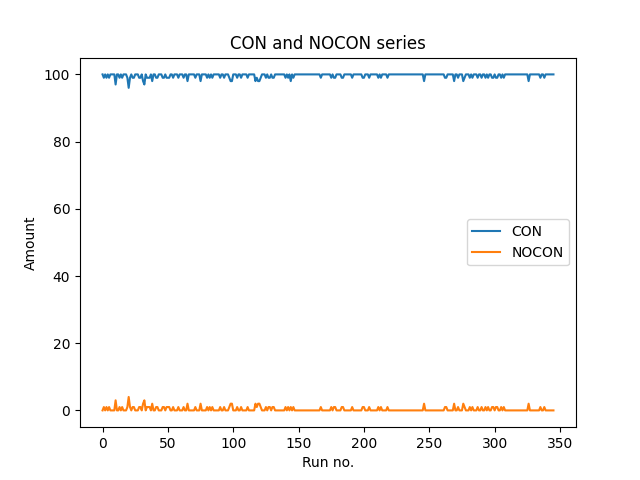
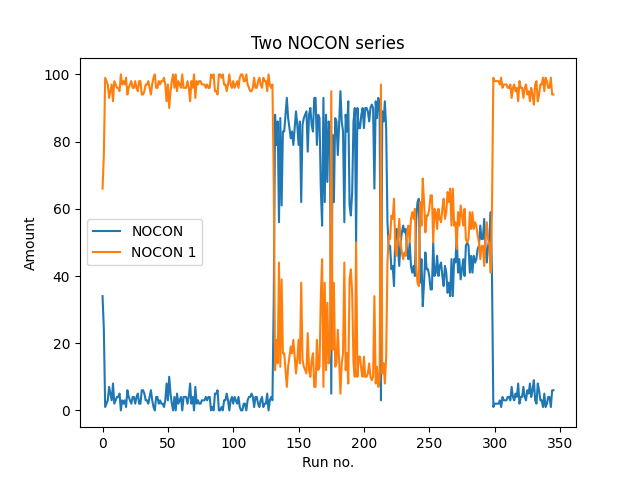
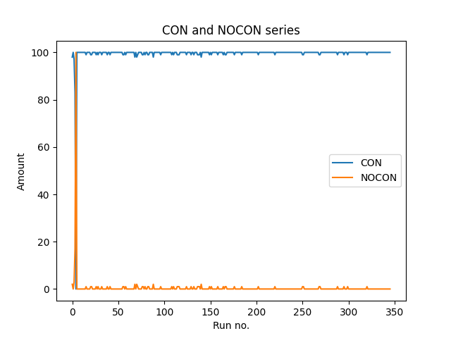
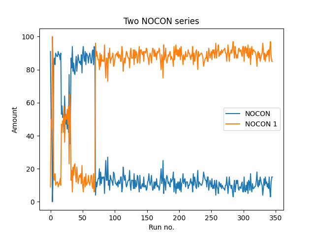
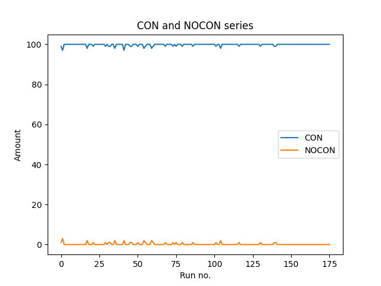
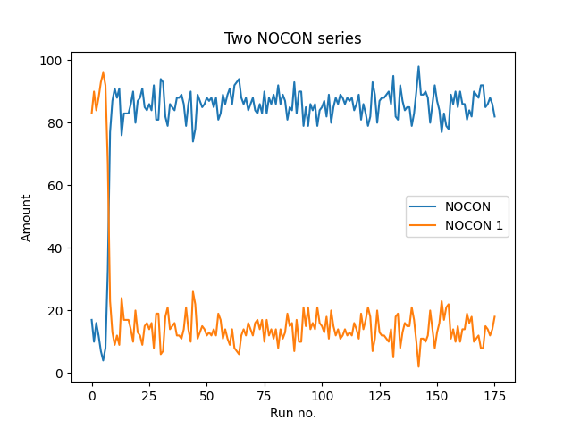
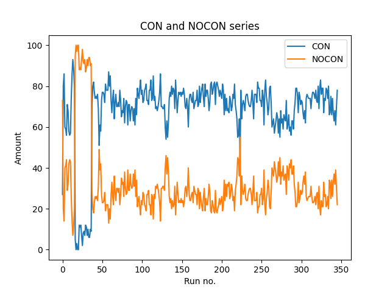
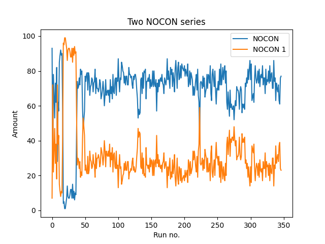
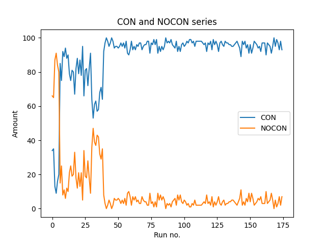
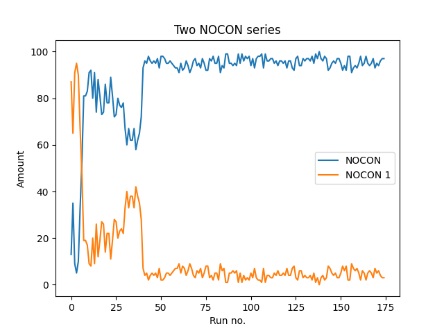

# Remote environment with 2 queues
The right hand side image uses a different port for the CON segments
## Series no. 1
 
## Series no. 2
 
## Series no. 3
 
## Series no. 1 with no client running at all 
 
## Series no. 2 with no client running at all 
 

# Remote environment with 4 queues

## Series no.1 
 
## Series no.2 
 
## Series no.3
 
## Series no. 1 with no client running at all 
 
## Series no. 2 with no client running at all 
 